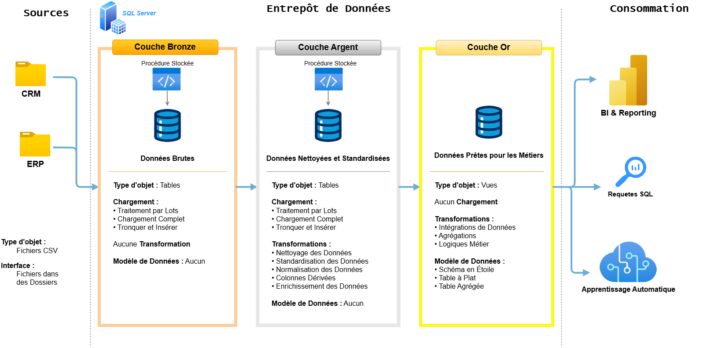

# Projet d'Entrepôt de Données et d'Analyse

Ce projet présente une solution complète d'entreposage et d'analyse de données, depuis la construction de l'entrepôt jusqu'à la génération d'informations exploitables. 

---

## 🏗️ Architecture des Données

L'architecture des données de ce projet suit l'**Architecture Médaillon** en trois couches : **Bronze**, **Argent** et **Or** :



1. **Couche Bronze** : Stocke les données brutes telles qu'elles proviennent des systèmes sources. Les données sont ingérées depuis des fichiers CSV vers une base de données SQL Server.
2. **Couche Argent** : Cette couche comprend les processus de nettoyage, de standardisation et de normalisation des données afin de les préparer à l'analyse.
3. **Couche Or** : Contient les données prêtes à l'emploi pour les métiers, modélisées selon un schéma en étoile adapté aux besoins de reporting et d'analyse.

---

## 📖 Présentation du Projet

Ce projet comprend :

1. **Architecture des Données** : Conception d'un entrepôt de données moderne selon l'Architecture Médaillon (couches Bronze, Argent et Or).
2. **Pipelines ETL** : Extraction, transformation et chargement des données depuis les systèmes sources vers l'entrepôt.
3. **Modélisation des Données** : Développement de tables de faits et de dimensions optimisées pour les requêtes analytiques.
4. **Analyse et Reporting** : Création de rapports SQL et de tableaux de bord pour des informations exploitables.

🎯 Ce dépôt constitue une ressource de valeur pour les étudiants et professionnels souhaitant démontrer leur expertise dans les domaines suivants :
- Développement SQL
- Architecture des Données
- Ingénierie des Données
- Développement de Pipelines ETL
- Modélisation des Données
- Analyse de Données

---

## 🛠️ Liens et Outils Importants

- **[Jeux de données](datasets/)** : Accès aux données du projet (fichiers CSV).
- **[SQL Server Express](https://www.microsoft.com/en-us/sql-server/sql-server-downloads)** : Serveur léger pour héberger votre base de données SQL.
- **[SQL Server Management Studio (SSMS)](https://learn.microsoft.com/en-us/sql/ssms/download-sql-server-management-studio-ssms?view=sql-server-ver16)** : Interface graphique pour gérer et interagir avec les bases de données.
- **[Dépôt Git](https://github.com/)** : Créer un compte GitHub pour gérer, versionner et collaborer efficacement sur le code.
- **[DrawIO](https://www.drawio.com/)** : Outil de conception pour les architectures de données, les modèles, les flux et les diagrammes.

---

## 🚀 Cahier des Charges

### Construction de l'Entrepôt de Données (Ingénierie des Données)

#### Objectif
Développer un entrepôt de données moderne à l'aide de SQL Server afin de centraliser les données de vente, permettant ainsi la production de rapports analytiques et la prise de décisions éclairées.

#### Spécifications
- **Sources de données** : Importation des données depuis deux systèmes sources (ERP et CRM) fournis sous forme de fichiers CSV.
- **Qualité des données** : Nettoyage et résolution des problèmes de qualité des données avant toute analyse.
- **Intégration** : Combinaison des deux sources en un modèle de données unique et convivial, conçu pour les requêtes analytiques.
- **Périmètre** : Focalisation sur le jeu de données le plus récent uniquement ; l'historisation des données n'est pas requise.
- **Documentation** : Fourniture d'une documentation claire du modèle de données pour les parties prenantes métier et les équipes analytiques.

---

### BI : Analyse et Reporting (Analyse des Données)

#### Objectif
Développer des analyses SQL pour produire des informations détaillées sur :
- **Le comportement des clients**
- **La performance des produits**
- **Les tendances des ventes**

Ces analyses fournissent aux parties prenantes des indicateurs clés métier, permettant une prise de décision stratégique.

Pour plus de détails, consulter [docs/requirements.md](docs/requirements.md).

---

## 📂 Structure du Dépôt

```
data-warehouse-project/
│
├── datasets/                           # Jeux de données bruts du projet (données ERP et CRM)
│
├── docs/                               # Documentation et détails d'architecture du projet
│   ├── etl.drawio                      # Fichier Draw.io illustrant les techniques et méthodes ETL
│   ├── data_architecture.drawio        # Fichier Draw.io de l'architecture du projet
│   ├── data_catalog.md                 # Catalogue des jeux de données (descriptions des champs et métadonnées)
│   ├── data_flow.drawio                # Fichier Draw.io du diagramme de flux de données
│   ├── data_models.drawio              # Fichier Draw.io des modèles de données (schéma en étoile)
│   ├── naming-conventions.md           # Conventions de nommage pour les tables, colonnes et fichiers
│
├── scripts/                            # Scripts SQL pour l'ETL et les transformations
│   ├── bronze/                         # Scripts d'extraction et de chargement des données brutes
│   ├── silver/                         # Scripts de nettoyage et de transformation des données
│   ├── gold/                           # Scripts de création des modèles analytiques
│
├── tests/                              # Scripts de tests et fichiers de contrôle qualité
│
├── README.md                           # Présentation du projet et instructions
├── LICENSE                             # Informations de licence du dépôt
├── .gitignore                          # Fichiers et répertoires exclus du suivi Git
└── requirements.txt                    # Dépendances et prérequis du projet
```

---

## 🌟 À Propos

Bonjour ! Je suis **Abdessettar Fatima-Ezzahra**, étudiante en ingénierie informatique, passionnée le traitement des données de manière accessible et engageante.